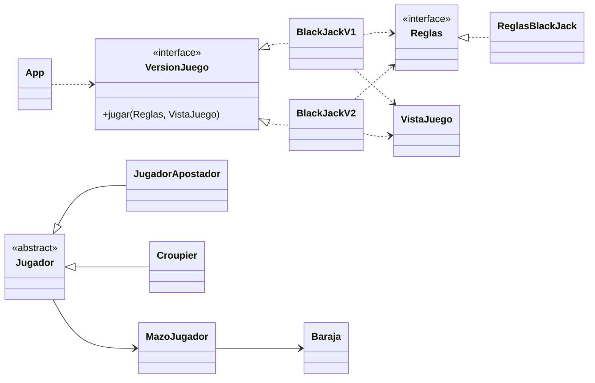
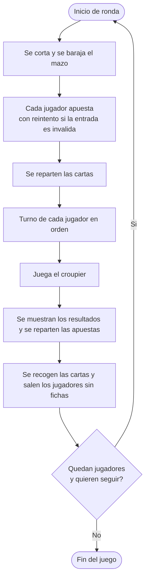

# ♠ BlackJack en consola ♥

Blackjack por turnos para la terminal, escrito en **Java puro** y sin dependencias. Juega solo contra el croupier (**V1**) o con **2 a 6 jugadores** en la misma mesa (**V2**), apostando fichas y viendo las cartas dibujadas en pantalla. El código separa el flujo del juego, las reglas y la vista, para poder cambiar o ampliar cada parte sin tocar las demás.


## Contenido

- [Vista previa](#vista-previa)
- [Características](#características)
- [Requisitos](#requisitos)
- [Instalación y ejecución](#instalación-y-ejecución)
- [Cómo jugar](#cómo-jugar)
- [Reglas del juego](#reglas-del-juego)
- [Versiones](#versiones)
- [Arquitectura](#arquitectura)
- [Cómo extender el proyecto](#cómo-extender-el-proyecto)
- [Limitaciones e ideas a futuro](#limitaciones-e-ideas-a-futuro)
- [Créditos](#créditos)

## Vista previa

Así se ve el turno de un jugador (la segunda carta del croupier permanece tapada):

```text
▶ Jugador #1
┌────────────────────────────────────┐
│ Mano del croupier                  │
├────────────────────────────────────┤
│ ╭───────╮ ╭───────╮                │
│ │ 5     │ │░░░░░░░│                │
│ │       │ │░░░░░░░│                │
│ │   ♥   │ │░░░░░░░│                │
│ │       │ │░░░░░░░│                │
│ │     5 │ │░░░░░░░│                │
│ ╰───────╯ ╰───────╯                │
└────────────────────────────────────┘
┌────────────────────────────────────┐
│ Tu mano                            │
├────────────────────────────────────┤
│ ╭───────╮ ╭───────╮                │
│ │ 5     │ │ 5     │                │
│ │       │ │       │                │
│ │   ♠   │ │   ♦   │                │
│ │       │ │       │                │
│ │     5 │ │     5 │                │
│ ╰───────╯ ╰───────╯                │
└────────────────────────────────────┘
Puntaje de cartas: 10
┌────────────────────────────────────┐
│ Accion                             │
├────────────────────────────────────┤
│ [1] Pedir carta                    │
│ [2] Pasar                          │
└────────────────────────────────────┘
➜ Que accion desea realizar:
```

En la terminal las cartas se ven con fondo blanco y los colores de cada palo, y los mensajes de victoria, derrota y empate van en verde, rojo y gris.

## Características

- **Dos versiones del juego:** un jugador contra el croupier (V1) y de 2 a 6 jugadores (V2).
- **Apuestas con fichas:** mínima, máxima o personalizada, con cinco tipos de ficha.
- **Interfaz en consola** con tablas, cartas dibujadas, colores ANSI y símbolos de los palos.
- **Mazo de 52 cartas** que se corta y se baraja al inicio de cada ronda; las cartas se recogen al terminarla.
- **Entradas validadas:** si escribes una opción inválida, se muestra el error y se vuelve a preguntar.
- **Reglas intercambiables:** todo lo que es regla del juego vive detrás de la interfaz `Reglas`.
- **Sin dependencias externas.**

## Requisitos

- **JDK 11 o superior.** El código usa `String.repeat`, que apareció en Java 11. Se compiló y probó con Java 21.
- **Una terminal con UTF-8 y colores ANSI** (idealmente de 256 colores) para ver bien las cartas y los símbolos ♠ ♥ ♦ ♣. Algunas consolas integradas de los IDE no los muestran correctamente.

## Instalación y ejecución

Clona el repositorio y entra a la carpeta del proyecto:

```bash
git clone <url-del-repositorio>
cd <carpeta-del-proyecto>
```

Compila y ejecuta desde la terminal.

**Linux y macOS**

```bash
mkdir -p out
javac -encoding UTF-8 -d out $(find . -name "*.java")
java -cp out mx.tecnm.culiacan.App
```

**Windows (PowerShell)**

```powershell
mkdir out -Force
javac -encoding UTF-8 -d out (Get-ChildItem -Recurse -Filter *.java).FullName
java -cp out mx.tecnm.culiacan.App
```

También puedes abrir el proyecto en tu IDE (IntelliJ IDEA, Eclipse, NetBeans, VS Code) y ejecutar el método `main` de la clase `App`.

> **Si ves símbolos raros** en Windows, usa Windows Terminal o ejecuta `chcp 65001` en `cmd` antes de iniciar el juego. Agregar `-Dfile.encoding=UTF-8` al comando `java` también suele resolverlo.

### Elegir la versión

La versión que se juega se decide en `App.java`:

```java
public class App {
    public static void main(String[] args) {
        Reglas reglas = new ReglasBlackJack();
        VistaJuego vistaJuego = new VistaJuego();
        VersionJuego versionJuego = new BlackJackV2(); // o new BlackJackV1()
        versionJuego.jugar(reglas, vistaJuego);
    }
}
```

## Cómo jugar

### Fichas iniciales

Cada jugador empieza con su propio juego de fichas:

| Ficha  | Valor nominal | Cantidad inicial |
|--------|--------------:|-----------------:|
| BLANCA |             1 |               10 |
| ROJA   |             5 |                5 |
| VERDE  |            25 |                2 |
| NEGRA  |           100 |                2 |
| MORADA |           500 |                1 |

### Desarrollo de una ronda

1. **Apuestas.** Cada jugador elige cómo apostar:
   - **Mínima:** 5 fichas blancas.
   - **Máxima:** todas sus fichas.
   - **Personalizada:** eliges el tipo de ficha (por el número de la tabla de fichas) y cuántas apostar.
2. **Reparto.** Cada jugador recibe dos cartas y el croupier otras dos, una de ellas tapada.
3. **Turnos.** Cada jugador, en orden, elige entre **1) Pedir carta** o **2) Pasar**. El turno termina al pasar, al llegar a 21 o al pasarse de 21.
4. **Croupier.** Descubre su mano y pide cartas según su regla.
5. **Resultado.** Se muestra el resultado de cada jugador y se reparten las apuestas.
6. **Siguiente ronda.** Se elige **1) Jugar de nuevo** o **2) Terminar**.

El juego también termina cuando ya no queda ningún jugador con fichas. En la V2, quien se queda sin fichas sale de la mesa y los demás siguen jugando.

## Reglas del juego

**Objetivo:** acercarte a 21 puntos sin pasarte y quedar por encima del croupier.

| Carta       | Valor                                         |
|-------------|-----------------------------------------------|
| 2 a 10      | Su número                                     |
| J, Q, K     | 10                                            |
| As (A)      | 11, o 1 si con 11 te pasarías de 21 (automático) |

**BlackJack:** 21 con las dos primeras cartas.

### Resultados

| Situación                                                    | Resultado |
|--------------------------------------------------------------|-----------|
| Te pasas de 21                                               | Derrota (aunque el croupier también se pase) |
| El croupier se pasa de 21                                    | Victoria  |
| Tu puntaje es mayor que el del croupier                      | Victoria  |
| Tu puntaje es menor que el del croupier                      | Derrota   |
| Puntajes iguales                                             | Empate    |
| BlackJack del jugador (y el croupier no)                     | Victoria  |
| BlackJack del croupier (y el jugador no)                     | Derrota   |
| BlackJack de ambos                                           | Empate    |

### Apuestas y pagos

El croupier **iguala** lo que apuestas, y entre los dos forman el pozo:

| Resultado | Qué pasa con tu apuesta                                      |
|-----------|--------------------------------------------------------------|
| Victoria  | Recibes todo el pozo: recuperas lo apostado y ganas otro tanto igual (1 a 1). |
| Empate    | Te devuelven exactamente lo que apostaste.                   |
| Derrota   | Pierdes lo apostado.                                         |

Por ejemplo, si apuestas 5 fichas blancas y ganas, recibes 10 y terminas con 5 fichas más que antes.

### Reglas del croupier

- Pide carta mientras tenga **menos de 17** y se planta con 17 o más.
- Solo pide carta si al menos un jugador sigue en juego con **menos de 21**. Si todos se pasaron o tienen 21 exacto, no pide.

### Detalles a tener en cuenta

- Las apuestas y los pagos se cuentan por **cantidad de fichas**, no por su valor nominal.
- El BlackJack se paga igual que una victoria normal (1 a 1), no 3 a 2.
- No hay dividir, doblar, seguro ni rendirse: las únicas acciones son pedir carta y pasar.
- **Solo en la V2:** si el croupier tiene BlackJack, se descubre en el primer turno y se resuelve la ronda para todos. Si lo tiene un jugador, se le paga de inmediato y la carta tapada del croupier sigue oculta para no dar información a quienes aún no juegan.

## Versiones

|                          | V1 (`BlackJackV1`)                         | V2 (`BlackJackV2`)                                   |
|--------------------------|--------------------------------------------|------------------------------------------------------|
| Jugadores                | 1                                          | De 2 a 6 (se pregunta al iniciar)                    |
| Turnos                   | Un solo jugador                            | En orden, y el croupier juega una vez al final       |
| Apuestas                 | Del jugador                                | De cada jugador, con sus propias fichas              |
| Quién sale de la partida | El juego termina al quedarse sin fichas    | Cada jugador sale al quedarse sin fichas             |
| Pregunta de continuar    | Al terminar cada ronda                     | Una por ronda, para toda la mesa                     |

## Arquitectura

El proyecto está organizado alrededor de tres piezas que no dependen de los detalles de las otras: **la versión del juego** decide el flujo, **las reglas** deciden qué es válido y quién gana, y **la vista** muestra todo en pantalla.



### Clases

| Capa              | Clase                | Responsabilidad                                                                 |
|-------------------|----------------------|---------------------------------------------------------------------------------|
| Entrada           | `App`                | Punto de entrada. Elige la versión, las reglas y la vista.                      |
| Versiones         | `VersionJuego`       | Contrato `jugar(Reglas, VistaJuego)` que cumple cada versión.                   |
|                   | `BlackJackV1`        | Flujo del juego para un jugador.                                                |
|                   | `BlackJackV2`        | Flujo del juego para 2 a 6 jugadores.                                           |
| Reglas            | `Reglas`             | Interfaz con las constantes y operaciones de las reglas.                        |
|                   | `ReglasBlackJack`    | Puntajes, BlackJack, resultado, validaciones, apuestas y pagos.                 |
|                   | `ReglasException`    | Excepción (sin verificar) que lanzan las reglas ante una entrada inválida.      |
| Vista             | `VistaJuego`         | Todo lo que se imprime y se pide por teclado: tablas, cartas, menús y mensajes. |
|                   | `Keyboard`           | Lectura de datos desde la entrada estándar.                                     |
| Modelo            | `Jugador`            | Clase base abstracta: fichas y mazo.                                            |
|                   | `JugadorApostador`   | Jugador con mano de cartas y fichas propias.                                    |
|                   | `Croupier`           | Reparte cartas, maneja el mazo y guarda la apuesta en juego.                    |
|                   | `Baraja`, `MazoJugador` | Mazo de 52 cartas, con barajado y corte.                                     |
|                   | `Carta`, `Ficha`     | Enumeraciones de palos y de tipos de ficha.                                     |
|                   | `GeneradorDeFichas`  | Crea el juego inicial de fichas de cada jugador.                                |
|                   | `DictamenJugador`    | Resultado de una mano: `VICTORIA`, `EMPATE` o `DERROTA`.                        |

### Decisiones de diseño

- **Las versiones solo dirigen el flujo.** Puntajes, BlackJack, resultado, validaciones y pagos están en `Reglas`, y todo lo que se muestra o se pregunta está en `VistaJuego`.
- **Las versiones no lanzan excepciones.** Las reglas lanzan `ReglasException` cuando algo es inválido y la versión la atrapa para mostrar el error y repetir la pregunta.
- **La vista no decide nada.** Recibe el resultado ya calculado y solo elige el mensaje y el color.
- **Fichas por jugador.** Cada `JugadorApostador` recibe su propio `GeneradorDeFichas`, así que ninguno comparte fichas con otro.
- **Apuesta por jugador en la V2.** `Croupier` guarda una sola apuesta, por lo que la V2 conserva la de cada jugador aparte y se la devuelve al croupier justo antes de repartir ese pago.

### Flujo de una ronda (V2)



## Cómo extender el proyecto

- **Crear una nueva versión del juego:** implementa `VersionJuego`, usa los objetos `Reglas` y `VistaJuego` que recibe `jugar` y cámbiala en `App`. No necesitas modificar el modelo.
- **Cambiar las reglas** (por ejemplo, pagar el BlackJack 3 a 2 o que el croupier se plante en 17 blando): crea otra clase que implemente `Reglas` y pásala a `jugar`.
- **Cambiar la presentación:** todo lo visual está en `VistaJuego`. Los colores y el ancho de las tablas son constantes al inicio de la clase.
- **Agregar una validación:** añade el método a `Reglas`, impleméntalo en `ReglasBlackJack` lanzando `ReglasException`, y llámalo dentro del `try` de la versión.

## Limitaciones e ideas a futuro

- No incluye pruebas automatizadas.
- Las cartas se representan como texto (`"♠K"`); una clase `Carta` con palo y valor evitaría depender del formato del texto.
- Faltan jugadas como dividir, doblar, seguro y rendirse.
- Las apuestas podrían moverse a una clase propia (por ejemplo, `GestorApuestas`) para aligerar `ReglasBlackJack`.
- La V1 y la V2 comparten varios métodos parecidos; se podría extraer una clase base abstracta con lo común.

## Créditos

- La clase `Keyboard` es de **Lewis y Loftus** (libro *Java Software Solutions*), incluida tal cual para leer la entrada.
- **Autor:** _tu nombre_
- **Licencia:** _por definir (por ejemplo, MIT)_
